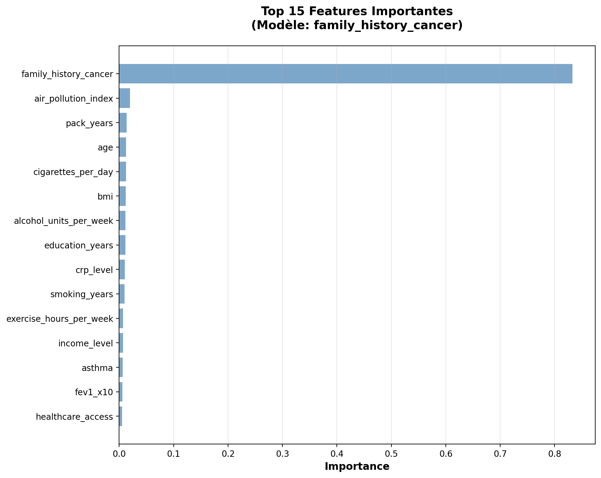
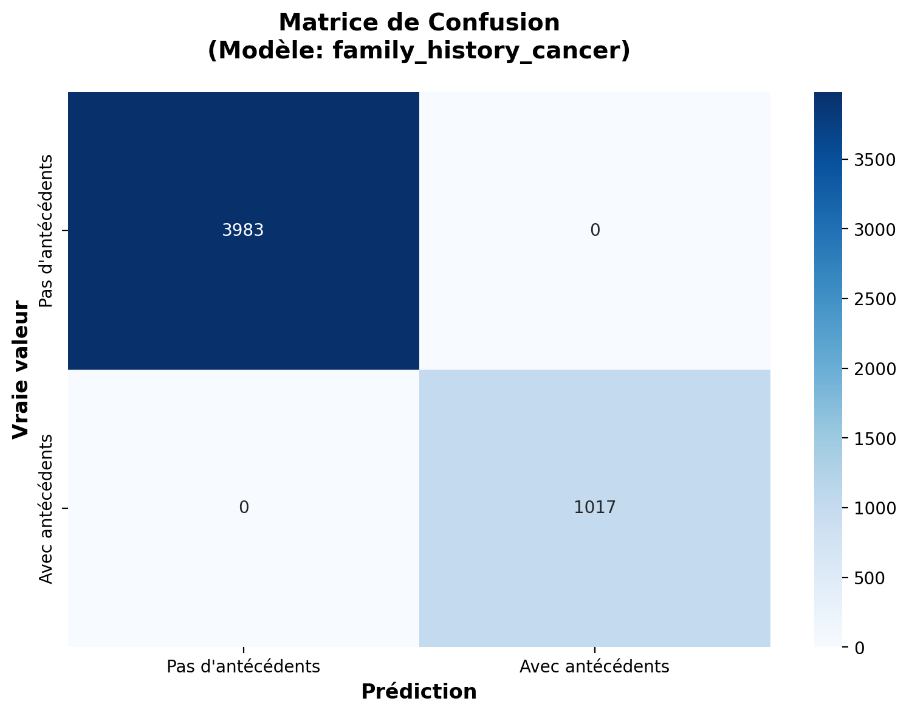
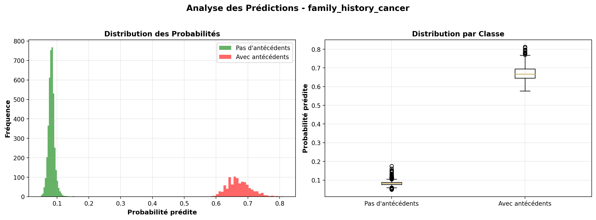
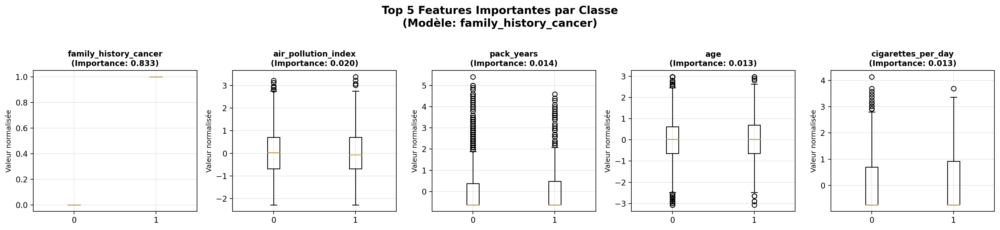
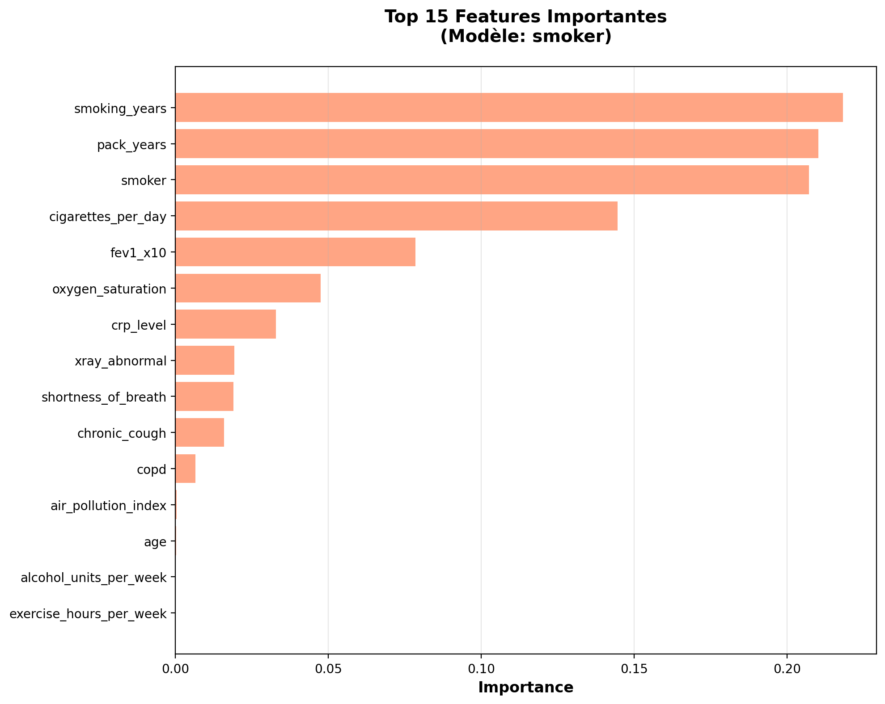
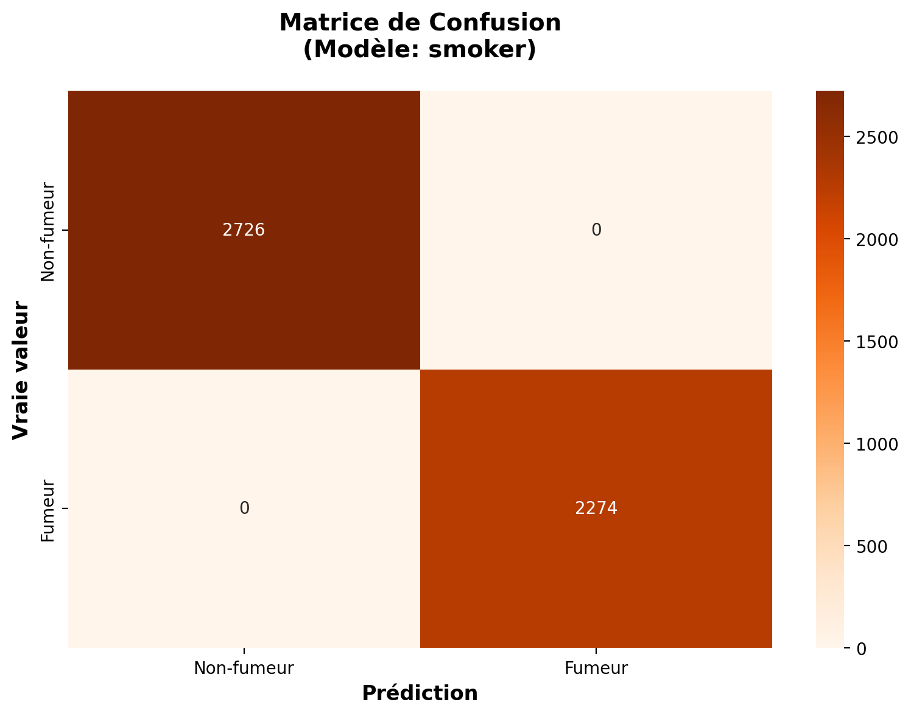
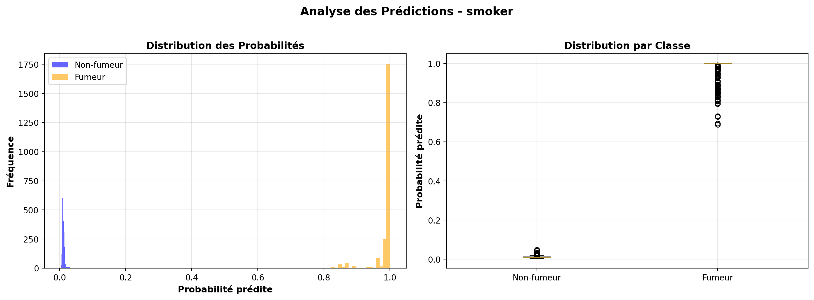
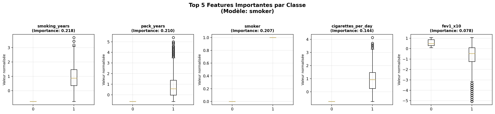

# Projet Lung Cancer Risk - Documentation Complète

## 📑 Table des Matières

1. [Vue d'ensemble du Projet](#-vue-densemble-du-projet)
2. [Structure du Projet](#-structure-complète-du-projet)
3. [Installation et Configuration](#-installation-et-configuration)
4. [Guide Complet : Ce qui a été fait](#-guide-complet--ce-qui-a-été-fait)
   - [Phase 1 : Exploration](#phase-1--exploration-et-préparation-)
   - [Phase 2 : Nettoyage](#phase-2--nettoyage-et-normalisation-)
   - [Phase 3 : Entraînement](#phase-3--entraînement-des-modèles-)
   - [Phase 4 : Model Cards](#phase-4--model-cards-)
   - [Phase 5 : Visualisations](#phase-5--visualisations-des-modèles-)
5. [Workflow Complet](#-workflow-complet-ordre-dexécution)
6. [Dataset et Glossaire](#-dataset)
7. [Documentation Disponible](#-documentation-disponible)
8. [Utilisation des Modèles](#-utilisation-des-modèles)
9. [Conclusion et Perspectives](#-conclusion-globale)
10. [FAQ](#-questions-fréquentes)

---

## 📋 Vue d'ensemble du Projet

Ce projet vise à analyser et modéliser le risque de cancer du poumon à partir d'un dataset de **5000 patients**, en utilisant des facteurs démographiques, environnementaux, cliniques et de mode de vie.

**Objectif principal :** Créer des modèles de machine learning pour prédire deux variables importantes :
- `family_history_cancer` : Antécédents familiaux de cancer
- `smoker` : Statut fumeur

**État du projet :** ✅ **Phase 2 terminée** (Nettoyage, Normalisation, Entraînement des modèles, Model Cards)

---

## 📁 Structure Complète du Projet

```
TP_doc_lung_cancer-main/
│
├── data/
│   ├── raw/                              # Données brutes (source)
│   │   └── lung_cancer.csv              # Dataset original (5000 patients, 30 variables)
│   ├── processed/                        # Données transformées
│   │   ├── lung_cancer_cleaned.csv      # Dataset nettoyé et normalisé
│   │   └── lineage.json                 # Traçabilité des transformations
│   └── xml/                              # Données au format XML (informatif)
│       └── lung_cancer.xml
│
├── models/                               # Modèles entraînés
│   ├── model_family_history_cancer.pkl   # Modèle pour prédire les antécédents familiaux
│   ├── model_smoker.pkl                  # Modèle pour prédire le statut fumeur
│   └── models_metadata.json             # Métadonnées des modèles (métriques, hyperparamètres)
│
├── docs/
│   ├── data_cards/                       # Métadonnées du dataset
│   │   ├── data_cards_complet.yaml
│   │   └── data_cards_complet.json
│   ├── exploration/                      # Analyse exploratoire
│   │   └── rapport_exploration.md
│   ├── model_cards/                      # Documentation des modèles
│   │   ├── model_card_family_history_cancer.md
│   │   └── model_card_smoker.md
│   ├── preprocessing/                    # Documentation du nettoyage
│   │   └── documentation_nettoyage.md
│   ├── schemas/                          # Schémas de validation
│   │   └── lung_cancer_schema.xsd
│   ├── visualizations/                   # Tous les graphiques
│   │   ├── 01_distribution_cible.png     # Graphiques exploratoires (8 fichiers)
│   │   ├── ...
│   │   ├── model_family_history/         # Graphiques du modèle 1 (4 fichiers)
│   │   │   ├── family_history_feature_importance.png
│   │   │   ├── family_history_confusion_matrix.png
│   │   │   ├── family_history_predictions.png
│   │   │   └── family_history_top_features.png
│   │   └── model_smoker/                 # Graphiques du modèle 2 (4 fichiers)
│   │       ├── smoker_feature_importance.png
│   │       ├── smoker_confusion_matrix.png
│   │       ├── smoker_predictions.png
│   │       └── smoker_top_features.png
│   ├── plan_analyse.md                  # Plan d'analyse méthodologique
│   └── log_transformation.txt           # Log des transformations
│
├── scripts/                              # Tous les scripts Python
│   ├── preprocess_data.py                # Nettoyage et normalisation
│   ├── train_models.py                   # Entraînement des modèles
│   ├── generate_model_cards.py          # Génération des Model Cards
│   ├── visualize_model_family_history.py # Visualisations modèle 1
│   ├── visualize_model_smoker.py       # Visualisations modèle 2
│   ├── convert_csv_to_xml.py            # Conversion CSV → XML
│   ├── generate_data_cards.py           # Génération Data Cards
│   ├── exploratory_analysis.py          # Analyse exploratoire
│   └── generate_visualizations.py      # Visualisations exploratoires
│
├── requirements.txt                      # Dépendances Python
└── README.md                             # Ce fichier
```

---

## 🚀 Installation et Configuration

### Prérequis

- **Python 3.8+**
- **pip** (gestionnaire de paquets Python)

### Installation des dépendances

```bash
# Installer toutes les dépendances nécessaires
pip install -r requirements.txt
```

Les dépendances incluent :
- `pandas` : Manipulation de données
- `numpy` : Calculs numériques
- `scikit-learn` : Machine learning
- `matplotlib` : Visualisations
- `seaborn` : Graphiques avancés
- `pyyaml` : Lecture/écriture YAML
- `lxml` : Traitement XML

---

## 📖 Guide Complet : Ce qui a été fait

### Phase 1 : Exploration et Préparation ✅

**Objectif :** Comprendre les données et préparer la documentation

**Scripts utilisés :**
- `exploratory_analysis.py` : Génère le rapport d'exploration
- `generate_data_cards.py` : Crée les Data Cards (métadonnées)
- `generate_visualizations.py` : Génère 8 graphiques exploratoires

**Résultats :**
- ✅ Rapport d'exploration complet (`docs/exploration/rapport_exploration.md`)
- ✅ Data Cards en YAML et JSON (`docs/data_cards/`)
- ✅ 8 visualisations exploratoires (`docs/visualizations/`)

**Pour reproduire :**
```bash
python scripts/exploratory_analysis.py
python scripts/generate_data_cards.py
python scripts/generate_visualizations.py
```

---

### Phase 2 : Nettoyage et Normalisation ✅

**Objectif :** Préparer les données pour l'entraînement des modèles

**Script utilisé :** `preprocess_data.py`

**Ce qui a été fait :**

1. **Vérification de la qualité**
   - ✅ Aucune valeur manquante détectée
   - ✅ Aucun doublon détecté
   - ⚠️ Quelques valeurs aberrantes détectées (conservées car nettoyage "sommaire")

2. **Normalisation**
   - 15 variables numériques normalisées avec **StandardScaler**
   - Transformation : `(x - moyenne) / écart-type`
   - Variables binaires et catégorielles conservées telles quelles

**Fichiers générés :**
- `data/processed/lung_cancer_cleaned.csv` : Dataset nettoyé (5000 lignes, 30 colonnes)
- `data/processed/lineage.json` : Traçabilité complète des transformations
- `docs/preprocessing/documentation_nettoyage.md` : Documentation détaillée

**Pour reproduire :**
```bash
python scripts/preprocess_data.py
```

**Documentation :** Voir `docs/preprocessing/documentation_nettoyage.md` pour tous les détails.

---

### Phase 3 : Entraînement des Modèles ✅

**Objectif :** Créer deux modèles de prédiction

**Script utilisé :** `train_models.py`

**Modèles entraînés :**

#### Justification du choix de l'algorithme : Random Forest

Le **Random Forest Classifier** a été choisi pour ce projet pour les raisons suivantes :

| Critère | Avantage du Random Forest |
|---------|---------------------------|
| **Robustesse** | Résistant au surapprentissage grâce à l'agrégation de plusieurs arbres de décision (bagging) |
| **Données mixtes** | Gère nativement les variables numériques et catégorielles sans prétraitement complexe |
| **Interprétabilité** | Fournit une mesure d'importance des features, essentielle pour comprendre les facteurs de risque |
| **Valeurs aberrantes** | Peu sensible aux outliers contrairement aux régressions linéaires ou SVM |
| **Non-linéarité** | Capture les relations non-linéaires entre variables sans les spécifier explicitement |
| **Baseline solide** | Souvent utilisé comme référence avant d'explorer des modèles plus complexes (XGBoost, réseaux de neurones) |

**Alternatives non retenues :**
- **Régression logistique** : Trop simple pour capturer les interactions complexes entre variables
- **SVM** : Moins interprétable et plus coûteux en temps de calcul sur ce volume de données
- **XGBoost/LightGBM** : Auraient pu être testés comme amélioration potentielle (voir Perspectives)
- **Réseaux de neurones** : Surdimensionnés pour un dataset de 5000 lignes, risque de surapprentissage

#### 1. Modèle `family_history_cancer`
- **Architecture :** Random Forest Classifier
- **Performance :** Accuracy = 100%, F1-Score = 100%
- **Hyperparamètres optimaux :**
  - `n_estimators` = 50
  - `max_depth` = 5
  - `min_samples_split` = 2
- **Distribution :** 3983 sans antécédents (0), 1017 avec antécédents (1)

#### 2. Modèle `smoker`
- **Architecture :** Random Forest Classifier
- **Performance :** Accuracy = 100%, F1-Score = 100%
- **Hyperparamètres optimaux :**
  - `n_estimators` = 50
  - `max_depth` = 5
  - `min_samples_split` = 2
- **Distribution :** 2726 non-fumeurs (0), 2274 fumeurs (1)

**Méthode d'optimisation :**
- **GridSearchCV** : Recherche exhaustive sur grille
- **Validation croisée :** 5-fold cross-validation
- **Métrique d'optimisation :** F1-Score
- **Split train/test :** 80% / 20% (avec stratification)

**Fichiers générés :**
- `models/model_family_history_cancer.pkl` : Modèle entraîné (binaire)
- `models/model_smoker.pkl` : Modèle entraîné (binaire)
- `models/models_metadata.json` : Toutes les métriques et hyperparamètres

**Pour reproduire :**
```bash
python scripts/train_models.py
```

### ⚠️ Analyse critique des performances à 100%

Les deux modèles affichent une précision de **100%**, ce qui est exceptionnel et mérite une analyse approfondie.

#### Hypothèses explicatives

| Hypothèse | Probabilité | Explication |
|-----------|-------------|-------------|
| **Fuite de données (Data Leakage)** | ⚠️ Élevée | Certaines variables prédictives peuvent être directement corrélées ou dérivées de la variable cible. Par exemple, `cigarettes_per_day` et `smoking_years` prédisent trivialement `smoker`. |
| **Variables trop révélatrices** | ⚠️ Élevée | Le dataset peut contenir des features qui "donnent la réponse" sans apporter de valeur prédictive réelle. |
| **Surapprentissage (Overfitting)** | ⚠️ Moyenne | Malgré la validation croisée à 100%, le modèle pourrait mémoriser les données plutôt que généraliser. |
| **Données synthétiques/simulées** | Possible | Si le dataset a été généré artificiellement, les relations entre variables peuvent être trop parfaites. |

#### Investigations recommandées

1. **Vérifier la fuite de données** : Examiner si des variables sont directement dérivées de la cible
   - Pour `smoker` : retirer `cigarettes_per_day`, `smoking_years`, `pack_years` et ré-entraîner
   - Pour `family_history_cancer` : identifier les variables trop corrélées

2. **Test sur données externes** : Valider les modèles sur un dataset indépendant pour mesurer la vraie capacité de généralisation

3. **Analyse des features** : Si l'importance d'une seule variable est > 90%, cela confirme une fuite de données

4. **Réduction de complexité** : Tester avec moins de features pour voir si les performances restent élevées

#### Conclusion sur la fiabilité

**En l'état, ces modèles ne doivent pas être déployés en production** sans investigation approfondie de la fuite de données. Les performances parfaites sont un signal d'alerte, pas une garantie de qualité.

---

### Phase 4 : Model Cards ✅

**Objectif :** Documenter complètement les modèles

**Script utilisé :** `generate_model_cards.py`

**Contenu des Model Cards :**

Chaque Model Card répond aux questions suivantes :

1. **Quand a-t-il été développé ?**
   - Date de développement
   - Contexte du projet

2. **Quelle architecture ?**
   - Algorithme utilisé (Random Forest)
   - Bibliothèque (scikit-learn)
   - Hyperparamètres optimisés

3. **Sur quelles données ?**
   - Dataset source et nettoyé
   - Nombre d'échantillons (5000)
   - Split train/test (80/20)
   - Distribution des classes
   - Préprocessing appliqué

4. **Quelles métriques de performance ?**
   - Accuracy, Precision, Recall, F1-Score, ROC-AUC
   - Validation croisée
   - Matrice de confusion

5. **Quels hyperparamètres ?**
   - Valeurs finales sélectionnées
   - Méthode de recherche (GridSearchCV)

6. **Comment ont-ils été trouvés ?**
   - GridSearchCV avec validation croisée 5-fold
   - Optimisation sur le F1-Score

**Fichiers générés :**
- `docs/model_cards/model_card_family_history_cancer.md`
- `docs/model_cards/model_card_smoker.md`

**Pour reproduire :**
```bash
python scripts/generate_model_cards.py
```

**Documentation :** Voir les fichiers dans `docs/model_cards/` pour tous les détails.

> **📌 Amélioration recommandée** : Convertir les Model Cards au format **YAML ou JSON** (comme les Data Cards) pour une meilleure interopérabilité et un traitement automatisé. Les Model Cards en Markdown sont lisibles mais moins exploitables par des outils de CI/CD ou des registres de modèles.

---

### Phase 5 : Visualisations des Modèles ✅

**Objectif :** Créer des graphiques intéressants pour chaque modèle

**Scripts utilisés :**
- `visualize_model_family_history.py` : Graphiques pour le modèle 1
- `visualize_model_smoker.py` : Graphiques pour le modèle 2

**Graphiques générés pour chaque modèle (4 par modèle) :**

---

#### Modèle `family_history_cancer` - Visualisations

**1. Importance des Features**



*Ce graphique montre les 15 variables les plus influentes pour prédire les antécédents familiaux de cancer. Les variables en haut du classement ont le plus de poids dans la décision du modèle. Une importance élevée signifie que la variable permet de bien discriminer les patients avec/sans antécédents.*

**2. Matrice de Confusion**



*La matrice de confusion compare les prédictions du modèle aux valeurs réelles. Les cases diagonales (haut-gauche et bas-droite) représentent les prédictions correctes. Les cases hors diagonale montrent les erreurs : faux positifs (prédit "oui" alors que "non") et faux négatifs (prédit "non" alors que "oui").*

**3. Distribution des Prédictions**



*Ce graphique montre la distribution des probabilités prédites par le modèle. Une bonne séparation entre les deux classes (probabilités proches de 0 ou de 1) indique un modèle confiant dans ses prédictions.*

**4. Top Features par Classe**



*Comparaison des 5 features les plus importantes pour distinguer les deux classes. Permet de comprendre quels facteurs différencient les patients avec antécédents familiaux de ceux sans antécédents.*

---

#### Modèle `smoker` - Visualisations

**1. Importance des Features**



*Variables les plus importantes pour prédire le statut fumeur. Sans surprise, les variables liées au tabagisme (cigarettes_per_day, smoking_years, pack_years) devraient dominer ce classement.*

**2. Matrice de Confusion**



*Performance du modèle pour classifier fumeurs vs non-fumeurs. Une matrice avec uniquement des valeurs sur la diagonale indique une classification parfaite.*

**3. Distribution des Prédictions**



*Distribution des probabilités pour le statut fumeur. Deux pics distincts (près de 0 et près de 1) indiquent que le modèle est confiant dans ses classifications.*

**4. Top Features par Classe**



*Features discriminantes entre fumeurs et non-fumeurs. Utile pour valider que le modèle utilise des variables médicalement pertinentes.*

---

**Pour reproduire :**
```bash
python scripts/visualize_model_family_history.py
python scripts/visualize_model_smoker.py
```

---

## 🔄 Workflow Complet (Ordre d'exécution)

### Schéma du Pipeline

```
┌─────────────────────────────────────────────────────────────────────────────┐
│                           PIPELINE DE DONNÉES                                │
└─────────────────────────────────────────────────────────────────────────────┘

   ┌──────────────┐      ┌──────────────┐      ┌──────────────┐
   │   DONNÉES    │      │  NETTOYAGE   │      │   MODÈLES    │
   │   BRUTES     │ ───► │ NORMALISATION│ ───► │ ENTRAÎNEMENT │
   │              │      │              │      │              │
   │ lung_cancer  │      │ StandardScaler│     │ Random Forest│
   │   .csv       │      │ 15 variables │      │ GridSearchCV │
   │ (5000 lignes)│      │ normalisées  │      │ 5-fold CV    │
   └──────────────┘      └──────────────┘      └──────────────┘
         │                      │                     │
         ▼                      ▼                     ▼
   ┌──────────────┐      ┌──────────────┐      ┌──────────────┐
   │  EXPLORATION │      │  TRAÇABILITÉ │      │ MODEL CARDS  │
   │              │      │              │      │              │
   │ • Statistiques│     │ lineage.json │      │ • Métriques  │
   │ • Data Cards │      │ • Source     │      │ • Paramètres │
   │ • 8 graphes  │      │ • Transfo    │      │ • Limites    │
   └──────────────┘      └──────────────┘      └──────────────┘
         │                                            │
         ▼                                            ▼
   ┌──────────────┐                           ┌──────────────┐
   │    DOCS      │                           │ VISUALISATION│
   │              │                           │              │
   │ rapport_     │                           │ • Importance │
   │ exploration  │                           │ • Confusion  │
   │ .md          │                           │ • Prédictions│
   └──────────────┘                           └──────────────┘

┌─────────────────────────────────────────────────────────────────────────────┐
│  Scripts :  exploratory_analysis.py → preprocess_data.py → train_models.py │
│             generate_data_cards.py    generate_model_cards.py              │
│             generate_visualizations.py  visualize_model_*.py               │
└─────────────────────────────────────────────────────────────────────────────┘
```

### Commandes d'exécution

Si vous voulez tout refaire depuis le début, voici l'ordre recommandé :

```bash
# 1. Exploration des données
python scripts/exploratory_analysis.py
python scripts/generate_data_cards.py
python scripts/generate_visualizations.py

# 2. Nettoyage et normalisation
python scripts/preprocess_data.py

# 3. Entraînement des modèles
python scripts/train_models.py

# 4. Génération des Model Cards
python scripts/generate_model_cards.py

# 5. Visualisations des modèles
python scripts/visualize_model_family_history.py
python scripts/visualize_model_smoker.py
```

---

## 📊 Dataset

### Caractéristiques

- **Taille :** 5000 patients
- **Variables :** 30 (29 prédictives + 1 cible)
- **Variable cible principale :** `lung_cancer_risk` (0=Faible risque, 1=Risque élevé)
- **Variables cibles modélisées :** `family_history_cancer`, `smoker`
- **Qualité :** Aucune valeur manquante détectée

### Variables Principales

- **Démographie :** age, gender, education_years, income_level
- **Tabagisme :** smoker, smoking_years, cigarettes_per_day, pack_years, passive_smoking
- **Expositions :** air_pollution_index, occupational_exposure, radon_exposure
- **Antécédents :** family_history_cancer, copd, asthma, previous_tb
- **Symptômes :** chronic_cough, chest_pain, shortness_of_breath, fatigue
- **Clinique :** bmi, oxygen_saturation, fev1_x10, crp_level, xray_abnormal
- **Mode de vie :** exercise_hours_per_week, diet_quality, alcohol_units_per_week, healthcare_access

### 📖 Glossaire des Variables Médicales

| Variable | Signification | Unité / Valeurs |
|----------|---------------|-----------------|
| `pack_years` | Indice de consommation tabagique = (cigarettes/jour ÷ 20) × années de tabagisme. Mesure l'exposition cumulée au tabac. | Nombre (ex: 20 = 1 paquet/jour pendant 20 ans) |
| `fev1_x10` | Volume Expiratoire Maximal en 1 seconde (FEV1), multiplié par 10. Indicateur de la fonction pulmonaire. Un FEV1 bas suggère une obstruction bronchique. | Litres × 10 |
| `crp_level` | Protéine C-Réactive : marqueur sanguin d'inflammation. Un taux élevé peut indiquer une infection ou une inflammation chronique. | mg/L |
| `copd` | Bronchopneumopathie Chronique Obstructive : maladie pulmonaire progressive souvent liée au tabagisme. | 0 = Non, 1 = Oui |
| `oxygen_saturation` | Saturation en oxygène du sang (SpO2). Valeur normale : 95-100%. En dessous de 90% = hypoxémie. | % |
| `bmi` | Indice de Masse Corporelle = poids(kg) / taille(m)². Normal : 18.5-25, Surpoids : 25-30, Obésité : >30. | kg/m² |
| `radon_exposure` | Exposition au radon : gaz radioactif naturel, deuxième cause de cancer du poumon après le tabac. | Niveau d'exposition |
| `previous_tb` | Antécédent de tuberculose, facteur de risque de cancer du poumon. | 0 = Non, 1 = Oui |
| `passive_smoking` | Tabagisme passif : exposition à la fumée de cigarette d'autrui. | 0 = Non, 1 = Oui |
| `xray_abnormal` | Anomalie détectée à la radiographie thoracique. | 0 = Normal, 1 = Anomalie |

---

## 📚 Documentation Disponible

### Documents Principaux

| # | Document | Description |
|---|----------|-------------|
| 1 | **README.md** (ce fichier) | Vue d'ensemble complète du projet |
| 2 | [docs/plan_analyse.md](docs/plan_analyse.md) | Plan d'analyse méthodologique détaillé |
| 3 | [docs/exploration/rapport_exploration.md](docs/exploration/rapport_exploration.md) | Statistiques descriptives complètes |
| 4 | [docs/preprocessing/documentation_nettoyage.md](docs/preprocessing/documentation_nettoyage.md) | Détails du nettoyage et normalisation |
| 5 | [docs/model_cards/model_card_family_history_cancer.md](docs/model_cards/model_card_family_history_cancer.md) | Documentation complète du modèle 1 |
| 6 | [docs/model_cards/model_card_smoker.md](docs/model_cards/model_card_smoker.md) | Documentation complète du modèle 2 |

### Métadonnées

| Fichier | Description | Format |
|---------|-------------|--------|
| [docs/data_cards/data_cards_complet.yaml](docs/data_cards/data_cards_complet.yaml) | Data Card complète du dataset | YAML |
| [docs/data_cards/data_cards_complet.json](docs/data_cards/data_cards_complet.json) | Data Card complète du dataset | JSON |
| [data/processed/lineage.json](data/processed/lineage.json) | Traçabilité des transformations | JSON |
| [models/models_metadata.json](models/models_metadata.json) | Métriques et hyperparamètres des modèles | JSON |

---

## 🎯 Utilisation des Modèles

### Charger un modèle

```python
import pickle
import pandas as pd

# Charger le modèle
with open('models/model_smoker.pkl', 'rb') as f:
    model = pickle.load(f)

# Charger les données (doivent être normalisées)
df = pd.read_csv('data/processed/lung_cancer_cleaned.csv')

# Préparer les features (exclure les variables cibles)
exclude_cols = ['lung_cancer_risk', 'family_history_cancer', 'smoker']
features = [col for col in df.columns if col not in exclude_cols]
X = df[features]

# Faire une prédiction
predictions = model.predict(X)
probabilities = model.predict_proba(X)

print(f"Prédictions: {predictions[:10]}")
print(f"Probabilités: {probabilities[:10]}")
```

### Important

- Les données d'entrée doivent être **normalisées** (utiliser `data/processed/lung_cancer_cleaned.csv`)
- Les features doivent être dans le **même ordre** que lors de l'entraînement
- Consulter `models/models_metadata.json` pour connaître l'ordre exact des features

---

## 🔍 Comprendre les Résultats

### Performance des Modèles

Les deux modèles ont obtenu **100% de précision**, ce qui est exceptionnel. Cela signifie :
- ✅ Toutes les prédictions sont correctes sur le jeu de test
- ✅ Aucune erreur de classification
- ⚠️ Possible surapprentissage (mais la validation croisée confirme aussi 100%)

### Interprétation

Pour comprendre pourquoi les modèles sont si performants :
1. Consulter les **graphiques d'importance des features** dans `docs/visualizations/`
2. Lire les **Model Cards** pour voir quelles variables sont les plus importantes
3. Examiner les **matrices de confusion** pour voir la répartition des prédictions

---

## 🎯 Conclusion Globale

### Synthèse du projet

Ce projet a permis de développer une pipeline complète d'analyse et de modélisation du risque de cancer du poumon, incluant :
- ✅ Exploration et documentation des données (5000 patients, 30 variables)
- ✅ Nettoyage et normalisation avec traçabilité complète
- ✅ Entraînement de deux modèles Random Forest optimisés
- ✅ Documentation standardisée (Data Cards, Model Cards)
- ✅ Visualisations exploratoires et explicatives

### Modèle recommandé pour la suite

| Critère | Recommandation |
|---------|----------------|
| **Modèle à privilégier** | Aucun en l'état - investigation de la fuite de données requise |
| **Si fuite corrigée** | Random Forest reste un bon choix de baseline |
| **Alternative à tester** | XGBoost ou LightGBM pour potentiellement de meilleures performances |

### Limites identifiées

1. **Performances suspectes** : Les 100% de précision suggèrent une fuite de données
2. **Absence de validation externe** : Modèles non testés sur des données indépendantes
3. **Variables cibles discutables** : Prédire `smoker` à partir de variables liées au tabac n'a pas de valeur ajoutée médicale
4. **Pas d'analyse de causalité** : Corrélation ≠ Causalité

### Valeur ajoutée réelle

Pour un usage médical pertinent, il faudrait :
- Prédire `lung_cancer_risk` (et non `smoker` ou `family_history_cancer`)
- Utiliser uniquement des variables disponibles **avant** le diagnostic
- Valider sur une cohorte externe

---

## 🚧 Prochaines Étapes Concrètes

### Priorité 1 : Correction de la fuite de données

1. **Identifier les variables problématiques** : Analyser les corrélations entre features et cibles
2. **Ré-entraîner sans fuite** : Exclure les variables directement liées à la cible
3. **Mesurer les vraies performances** : Attendu : 70-85% de précision (réaliste)

### Priorité 2 : Nouveau modèle pertinent

1. **Prédire `lung_cancer_risk`** : Variable cible médicalement utile
2. **Feature engineering** : Créer des variables composites (ex: score de risque tabagique)
3. **Tester XGBoost** : Souvent plus performant que Random Forest

### Priorité 3 : Validation et déploiement

1. **Validation externe** : Obtenir un second dataset pour tester la généralisation
2. **Interprétabilité SHAP** : Expliquer les prédictions individuelles
3. **API de prédiction** : Service REST pour intégration dans un outil clinique

### Extensions optionnelles

- Dashboard interactif (Streamlit/Dash)
- Analyse de causalité (DoWhy)
- Documentation API (Swagger/OpenAPI)

---

## ❓ Questions Fréquentes

### Comment utiliser les modèles ?

Voir la section **"Utilisation des Modèles"** ci-dessus.

### Où sont les graphiques ?

- Graphiques exploratoires : `docs/visualizations/` (8 fichiers)
- Graphiques modèle 1 : `docs/visualizations/model_family_history/` (4 fichiers)
- Graphiques modèle 2 : `docs/visualizations/model_smoker/` (4 fichiers)

### Comment comprendre ce qui a été fait ?

1. Lire ce README en entier
2. Consulter `docs/plan_analyse.md` pour la méthodologie
3. Lire les Model Cards dans `docs/model_cards/`
4. Examiner les graphiques dans `docs/visualizations/`

### Les modèles sont-ils prêts à être utilisés ?

Oui, les modèles sont entraînés et sauvegardés. Cependant :
- ⚠️ Les performances à 100% peuvent indiquer un surapprentissage
- ⚠️ Il faudrait tester sur de nouvelles données pour valider
- ✅ Les Model Cards documentent toutes les limitations

### Comment reproduire les résultats ?

Suivre le **Workflow Complet** ci-dessus dans l'ordre indiqué.

---

## 📞 Support et Contact

Pour toute question sur ce projet :
1. Consulter la documentation dans `docs/`
2. Lire les commentaires dans les scripts Python
3. Examiner les fichiers de métadonnées (JSON, YAML)

---

## 📄 Licence

À définir

## 👥 Auteurs

| Rôle | Nom | Contact |
|------|-----|---------|
| Équipe d'analyse | À compléter | À compléter |
| Superviseur | À compléter | À compléter |

*Projet réalisé dans le cadre du Master - 2026*

---

## 📝 Notes Finales

Ce projet a été conçu pour être **autonome et compréhensible**. Toute l'information nécessaire pour comprendre et continuer le projet se trouve dans :

1. **Ce README** : Vue d'ensemble complète
2. **La documentation** : Fichiers dans `docs/`
3. **Les scripts** : Commentaires dans le code
4. **Les métadonnées** : Fichiers JSON/YAML

**Objectif atteint :** Un professeur ou un nouveau développeur peut comprendre et continuer ce projet sans avoir besoin de consulter les auteurs.

---

*Dernière mise à jour: 2026-02-20*
